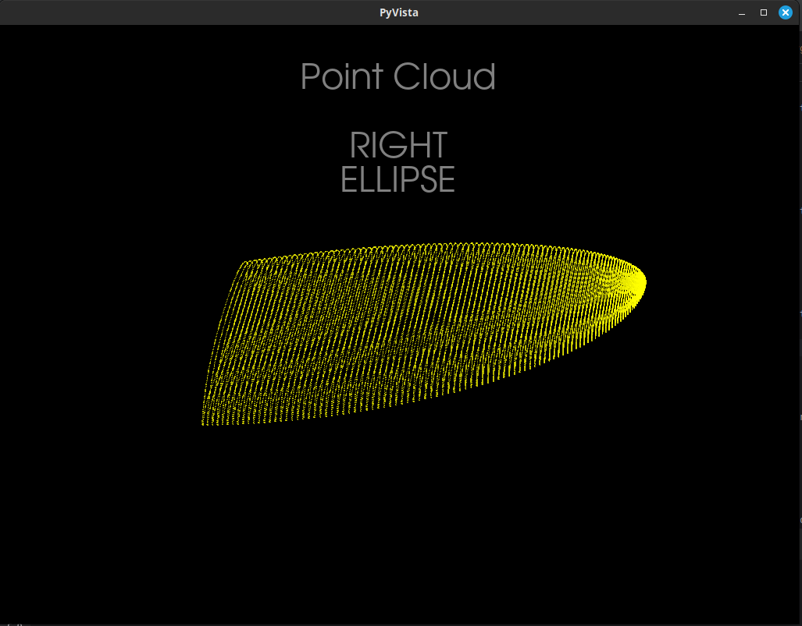
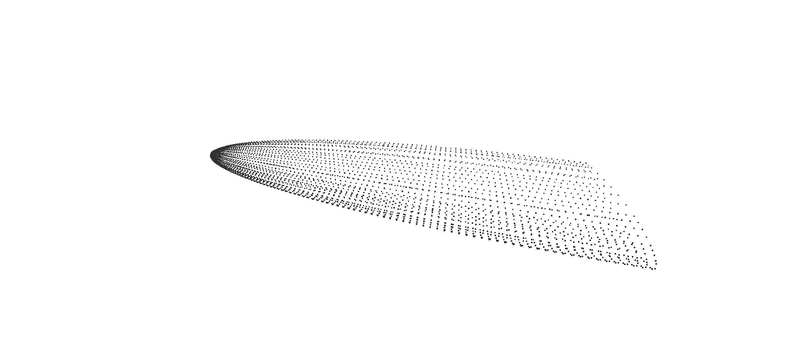

# WingWalker Examples

## Overview

This directory contains example script for using the major features of the WingWalker package.  As more features are 
added and refined, more examples will be included.

## Usage

Each of the scripts included in the examples have been built using Typer.  To run, simply enter

```shell
$ python3 path/to/example_script.py [arguments]
```

To see the available options and defaults, use the following pattern

```shell
$ python3 path/to/example_script.py --help
```

Typer-generated help text will be printed out, showing the required, optional, and default arguments. 

### Directory `examples/display`

This directory contains examples showing how to generate and preview various steps in the modeling process.

#### `preview_point_cloud.py`

```shell
(.venv) david@tanngnjostr ~/wingwalker-pypi/examples/display:
$ python3 ./preview_point_cloud.py --specfile selig_supercritical_nasa-sc2-1010.dat --spec-format selig 

Found airfoil id: NASA SC(2)-1010 AIRFOIL

AirfoilSpecs(src=selig_supercritical_nasa-sc2-1010.dat)
Wing generation complete
Wing Model
============================
Wing Type: RIGHT
Planform: Planform.ELLIPSE
Wing Span: 256.0
Base Chord: 96.0
End Chord: 48.0
Area: 38603.89052731138
MAC: 150.79644737231007
Full Aspect Ratio: 3.3953054526271007
Washout: 0.0
Iterations: 100

----------------------------
Airfoil Specifications:
Airfoil Name: NASA SC(2)-1010 AIRFOIL
Airfoil Sections: 100
----------------------------
Notes
 
```

At this point a PyVista popup window will appear, showing the point cloud that was generated.



### Directory `examples/printables`

These examples show how to create a wing model from specs and create various products to be used for 3D printing.

#### `generate_ply.py`

This script takes requested inputs and defaults, generates a wing model, then creates a point cloud and exports it to 
a PLY-formatted file.

```shell
(.venv) david@tanngnjostr ~/wingwalker-pypi/examples: 
$ python3 printables/generate_ply.py --specfile printables/selig_naca2412.dat --spec-format selig 

Found airfoil id: NACA 2412

AirfoilSpecs(src=printables/selig_naca2412.dat)
Wing generation complete
Wing Model
============================
Wing Type: RIGHT
Planform: Planform.ELLIPSE
Wing Span: 256.0
Base Chord: 96.0
End Chord: 48.0
Area: 38603.89052731138
MAC: 150.79644737231007
Full Aspect Ratio: 3.3953054526271007
Washout: 0.0
Iterations: 100

----------------------------
Airfoil Specifications:
Airfoil Name: NACA 2412
Airfoil Sections: 100
----------------------------
Notes
 
Exporting wing model to wing_pointcloud_StructType.WING_StructPosition.RIGHT_StructOrientation.UNDEFINED.ply
Wing Model
============================
Wing Type: RIGHT
Planform: Planform.ELLIPSE
Wing Span: 256.0
Base Chord: 96.0
End Chord: 48.0
Area: 38603.89052731138
MAC: 150.79644737231007
Full Aspect Ratio: 3.3953054526271007
Washout: 0.0
Iterations: 100

----------------------------
Airfoil Specifications:
Airfoil Name: NACA 2412
Airfoil Sections: 100
----------------------------
Notes
 
Wing model saved to wing_pointcloud_StructType.WING_StructPosition.RIGHT_StructOrientation.UNDEFINED.ply
os.stat_result(st_mode=33188, st_ino=12639769, st_dev=42, st_nlink=1, st_uid=1000, st_gid=1000, st_size=42252, st_atime=1759003132, st_mtime=1759003132, st_ctime=1759003132)
```

That PLY file can be imported into a MeshLab project, where it can be further processed before exporting an STL file and printed.



### Directory `examples/svg`

This subdirectory contains examples on how to use the SVG generation capabilities. This is a basic operation for 
the wingwalker package, and is a good starting point if the goal is to start with a basic airfoil trace and create a 
highly customized wing, rudder, or elevator.

#### `create_airfoil_svg.py`

Simple script to take a few arguments and generate one or more SVG images.

```shell
(.venv) david@tanngnjostr ~/wingwalker-pypi/examples/svg:  
$ python3 ./create_airfoil_svg.py --specfile lednicer_nasasc2-0714-il.dat --spec-format lednicer --poly --mirrored

SC(2)-0714 Supercritical airfoil (coordinates from Raymer w/ one correction)
        Format:  SpecFormat.LEDNICER
        Chord length:  128.000000 mm
        Total Coordinates:  98
        Trace:  False
        Fill:  False
        Poly:  True
        Mirror:  True

 2 images generated
```